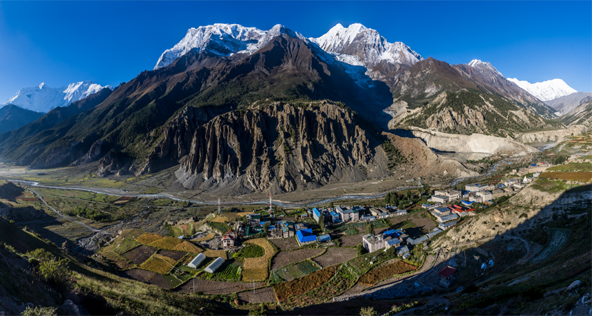
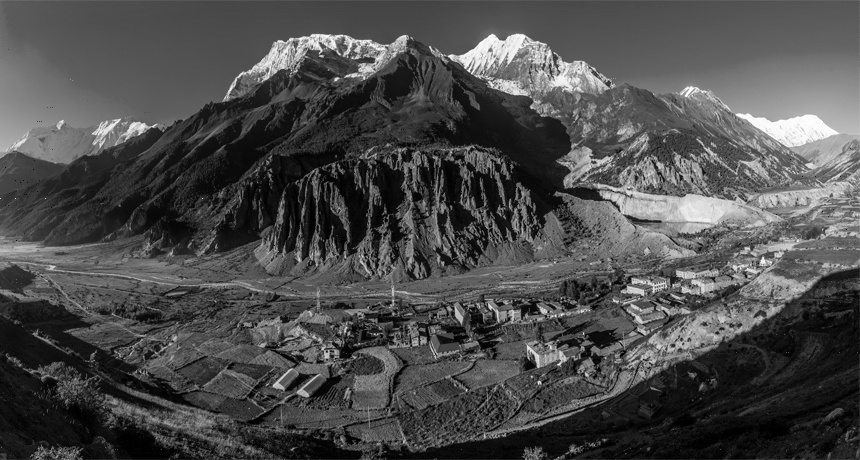

# LZ77 encoder and decoder in python

## implementing the lz77 encoder/decoder in python

i made the lz77 loseless coding to encode and decode image in grayscale not RGB 

## Encoding 

### install the required dependencies
> pip install opencv-python 
> pip install numpy 
> pip install matplotlib 

### run encode.py file
> python encode.py

### enter the image you would like to encode eg :
>  img1.jpg

### enter sliding window size eg:
> 1000

### enter look ahead buffer size eg : 
> 600

the code will run for a while and will then generate 2 ".npy" files, the "tuples.npy" file contain the tuples code, the second "chars.npy" file will contain the charchters encoded 
 
## Decoding 

### run decode.py file
> python decode.py

### enter tuple encoded file path that was outputted from encode script :
>  tuples.npy

### enter charachter encoded file path that was outputted from encode script :
>  chars.npy

### enter the image first dimension eg : 
> 460

### enter the image second dimension eg : 
> 860

then decoder will output the decoded image as decoded.jpg 

## the demo shown above 
### the original image

### the decoded image 

  
##### ps: for large images you might want to give it some time, main.py contain my encoder and decoder in same file 